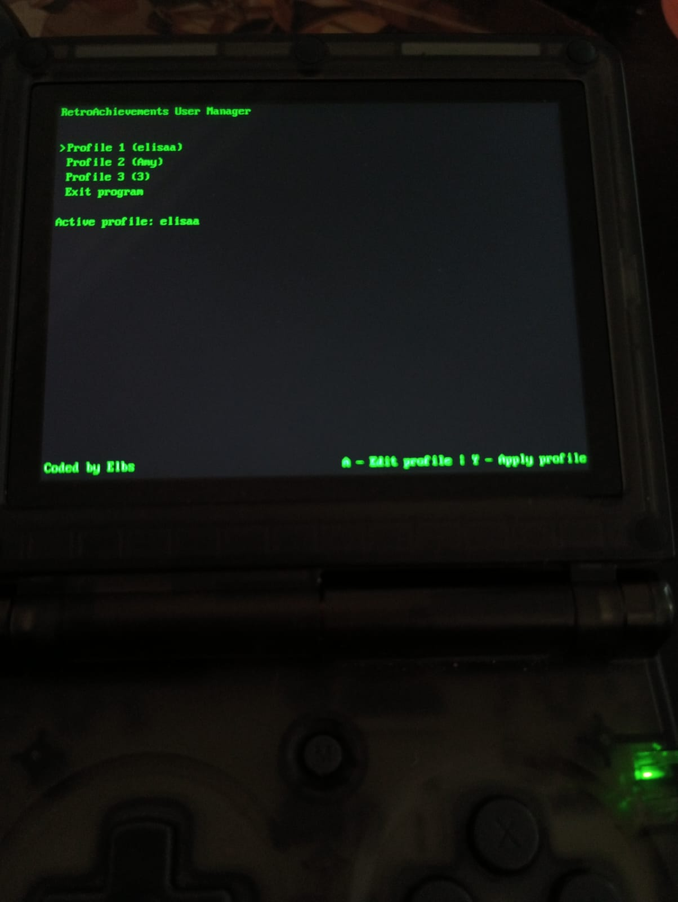

# RetroArch User Manager
This is a tool created for use in a Anbernic RG35XX, it provides an easy way of switching between retroachievements users, without the hassle of opening RetroArch and typing your credentials every time you want to switch accounts.

## Quirks
Since this needs to be compiled for aarch64, you need the aarch64 libraries installed in your system, I do not provide these libraries, in my system I copied over the /usr/lib dir from the console and configured the linker to search libraries in a separate folder.

## Dependencies
-[nlohmann c++ json library](https://github.com/nlohmann/json)  
-[SDL2](https://wiki.libsdl.org/SDL2/Installation)  
-gcc for aarch64 (aarch64-linux-gnu-g++) installed
## Compiling
To compile, run the following command:  

    /usr/bin/aarch64-linux-gnu-g++ -fpermissive -I/usr/include -Wl,-rpath-link,./libs -L./libs -lSDL2 -lSDL2_image -lSDL2_ttf -g src/screens/*.cpp src/*.cpp -o ./bin/applications/rausrmgr/rausermgr

After compiling, copy the content of the bin/applications folder to your applications folder. Ex: sd:/MUOS/application/    